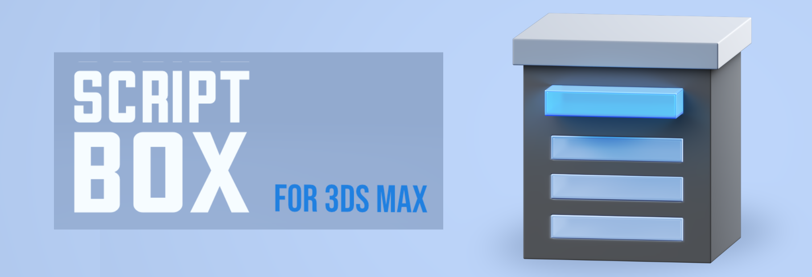
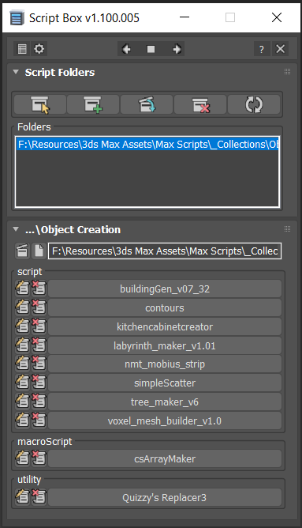
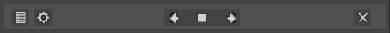
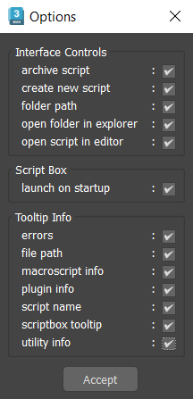
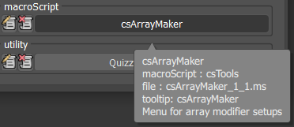
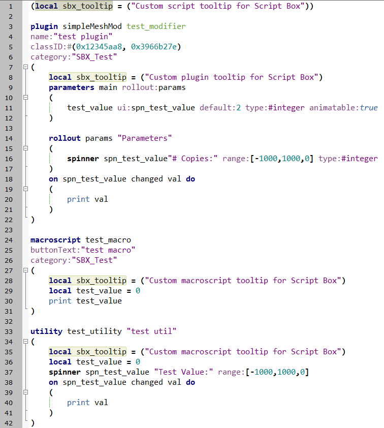

</img>
<div align="center">Create dynamic menus and run MaxScripts with a simple, customizable interface</div>
<div align="center">Organize your script collection in any way you like without installation and UI changes within 3ds Max</div>
<div align="center"><a href="https://www.youtube.com/watch?v=HqMXw3Hht64" target="_blank" rel="noopener noreferrer">Youtube</a> - <a href="https://dmz.gumroad.com/l/ScriptBox" target="_blank" rel="noopener noreferrer">Gumroad</a> - <a href="https://www.scriptspot.com/3ds-max/scripts/script-box" target="_blank" rel="noopener noreferrer">Scriptspot</a></div>


<h2> </h2>
</img>
<h3>Main Features</h3>

- Dynamic dialog menu 
- Execute MaxScripts from any folder
- Organized by macroScript, plugin, utility and regular scripts
- Multi-threaded file loading
- Dock, resize, and collapse dialogs
- Configure buttons and minimize UI
- Custom tooltips with aditional information
<h3>Support</h3>

- 3ds Max 2021 - 2025
- .ms, .mse, .mcr files
- macroScript, plugin and utility classes
<h3>Table of contents</h3>

- [User Interface](#ui)
	- [Top Menu](#ui_topmenu)
	- [Options](#ui_options)
	- [Script Folders](#ui_scriptfolders)
	- [Script Menu](#ui_scriptmenu)
- [Tooltips](#tt)
	- [Options](#tt_options)
	- [Custom tooltip](#tt_code)
	- [How to write a custom tooltip](#tt_howto)
- [Versions](#versions)
	- [1.002](#versions_1002)
	- [1.100](#versions_1100)


<h2> </h2>
<br>
<h1 align="center">User Interface</h1><a name="ui"></a>
</img>
<h3>Top Menu</h3><a name="ui_topmenu"></a>
<details open>
  <summary><b>Installer</b>: Open the Script Box installer</summary>

</details>
<details open>
  <summary><b>Options</b>: Open Script Box Options menu</summary>

</details>
<details open>
  <summary><b>DockLeft</b>: Dock the dialog to the left side</summary>

</details>
<details open>
  <summary><b>Float/Window</b>: Toggle the dialog between floating and docked modes</summary>

</details>
<details open>
  <summary><b>DockRight</b>: Dock the dialog menu to the right side</summary>

</details>
<details open>
  <summary><b>Help Documentation</b>: Go to gitHub main page</summary>

</details>
<details open>
  <summary><b>Close</b>: Close Script Box</summary>

</details>
<h2> </h2>
</img>
<h3>Options</h3><a name="ui_options"></a>
<details open>
  <summary><b>Interface Controls</b>: Select which buttons are available in the UI.</summary>

  > - archive script  
  > - create new script  
  > - folder path  
  > - open folder in explorer  
  > - open script in script editor  
</details>
<details open>
  <summary><b>Script Box</b>: general script options</summary>

  > - launch on startup  
</details>
<details open>
  <summary><b>Tooltip Info</b>: Select tooltip information for the script Launch Button</summary>

  > - errors  
  > - filepath  
  > - macroscript info  
  > - plugin info  
  > - script name  
  > - scriptbox tooltip  
  > - utility info  
</details>
<h2> </h2>
</img>
<h3>Script Folders</h3><a name="ui_scriptfolders"></a>
<details open>
  <summary><b>New Folder</b>: Select a new folder </summary>

  > Creates a menu for all MaxScripts in the selected folder  
  > Removes all menus from previously loaded folders in the Folders List  
</details>
<details open>
  <summary><b>Add Folder</b>: Select a folder to add it to existing folders</summary>

  > Adds a menu for all MaxScripts within the selected folder  
  > Re-loads all other menus for the folders in the Folders List  
</details>
<details open>
  <summary><b>Include Sub-Folders</b>: Include sub-folder hierarchy for the currently selected folder</summary>

  > Sub-folder named '_archive will be exluded  
  > Places all scripts from the folder hierarchy into one menu  
  > Re-loads all menus for the folders in the Folders List  
</details>
<details open>
  <summary><b>Remove Sub-Folders</b>: Exclude sub-folder hierarchy for the currently selected folder</summary>

  > Re-loads all menus for the folders in the Folders List  
</details>
<details open>
  <summary><b>Remove Folder</b>: Remove currently selected folder from Folders List</summary>

  > Re-load all menus from the remaining folders in the Folder List  
</details>
<details open>
  <summary><b>Reload all Folders</b>: Re-load all menus from folders in the Folder list</summary>

  > When editing the code of a script, you do not need to re-load for the changes to be included  
  > When editing macroscript, plugin or utility information you do need to re-load for the changes to be included  
  > When editing sbx_tooltip you do need to re-load for the changes to be included  
</details>
<details open>
  <summary><b>Folder List</b>: All folders currently loaded in Script Box</summary>

  > Select a folder to Include/Remove Sub-Folders or Remove Folder  
</details>
<h2> </h2>
</img>
<h3>Script Menu</h3><a name="ui_scriptmenu"></a>
This dialog is created when any MaxScripts are found within a selected folder.<br>
All collected script files are scanned for macroScripts, plugins and utility classes. Each instance of these classes gets a Launch Button that executes only that part of the script. The Launch Buttons are grouped according to these script classes. If no class instance can be found, the script is loaded as regular MaxScript and receives a single Launh Button.<br>
When 2 MaxScripts have the same name, but a different version numbers, only the highest version file will be loaded.
<br></br>
<details open>
  <summary><b>Open Folder</b>: Opens the script folder in Windows Explorer</summary>

  > Can be hidden in Options > Interface Controls > open folder in explorer  
</details>
<details open>
  <summary><b>Create New Script</b>: Opens a menu to create a new MaxScript file, inside the script folder</summary>

  > Type the name of the script and ScriptBox will create a .ms file  
  > You can create .ms or .mcr files by including the filetype in the name  
  > Will Re-load all menus and folders in Folder List  
  > Will open the new MaxScript in the Scripting Editor  
  > Can be hidden in Options > Interface Controls > create new script  
</details>
<details open>
  <summary><b>Folder Path</b>: Full folder path</summary>

  > Read-only  
  > Can be hidden in Options > Interface Controls > folder path  
</details>
<details open>
  <summary><b>Open Script</b>: Opens the script file in the Scripting Editor</summary>

  > Can be hidden in Options > Interface Controls > open script in editor  
</details>
<details open>
  <summary><b>Archive Script</b>: Move the MaxScript file to a sub-folder named '_archive'</summary>

  > Will Re-load Script Box and remove the script from the menu  
  > If the sub-folder '_archive' does not exist Script Box will created it in the folder where the MaxScript file is located  
  > Can be hidden in Options > Interface Controls > archive script  
</details>
<details open>
  <summary><b>Launch Button</b>: Execute the script</summary>

</details>
<h2> </h2>
<br>
<h1 align="center">Tooltips</h1><a name="tt"></a>
</img>
Script Box provides users with additional tooltip information for any launch script

- Script name, class and category
- File name and type
- Macroscript tooltip
Since version 1.1, you can customize the tooltip information for all Launch Buttons in 2 ways
- In Top Menu > Options, select what information items are displayed
- Enable 'scriptbox tooltip' in Options and add a custom line of code to your script class

<h2> </h2>
</img>
<h3>Options</h3><a name="tt_options"></a>
The following tooltip information items are available
<details open>
  <summary><b>errors</b>: list any errors detected while loading the script</summary>

</details>
<details open>
  <summary><b>filepath</b>: filepath of the script file</summary>

</details>
<details open>
  <summary><b>macroscript info</b>: name, category, tooltip of the macroScript</summary>

</details>
<details open>
  <summary><b>plugin info</b>: name and class of plugin</summary>

</details>
<details open>
  <summary><b>script name</b>: name of macroScript, plugin, utility or script file name</summary>

</details>
<details open>
  <summary><b>scriptbox tooltip</b>: custom tooltip text (see Tooltips section)</summary>

</details>
<details open>
  <summary><b>utility info</b>: name of utility<br></summary>

</details>
<h2> </h2>
<h3>Custom tooltip</h3><a name="tt_code"></a>
When 'scriptbox tooltip' is active in the Options menu, you can add a custom tooltip to any supported script class.
The required code to have this work looks as follows

- ```(local sbx_tooltip = ("Custom tooltip text"))```

<h2> </h2>
</img>
<h3>How to write a custom tooltip</h3><a name="tt_howto"></a>
There are 3 conditions for Script Box to regonize a custom tooltip

- Define a local variabel called ```local sbx_tooltip = ```
- Have the local variabel be the first line of code and inside brackets of the script class
- The value for the variabel has to be a string and has to be inside brackets ```("Custom tooltip")```
<br>
In the screenshot you can see an examples of valid sbx_tooltips for every supported script class
<details open>
  <summary><b>line 1</b>: Regular script tooltip </summary>

  > ```(local sbx_tooltip = ("Custom script tooltip for Script Box"))```  
</details>
<details open>
  <summary><b>line 8</b>: Plugin tooltip</summary>

  > ```(local sbx_tooltip = ("Custom plugin tooltip for Script Box"))```  
</details>
<details open>
  <summary><b>line 28</b>: MacroScript tooltip</summary>

  > ```(local sbx_tooltip = ("Custom macroscript tooltip for Script Box"))```  
</details>
<details open>
  <summary><b>line 35</b>: Uility tooltip</summary>

  > ```(local sbx_tooltip = ("Custom utility tooltip for Script Box"))```  
</details>

<h2> </h2>
<br>
<h1 align="center">Versions</h1><a name="versions"></a>
<h3>1.002</h3><a name="versions_1002"></a>
<details>
  <summary>feature list</summary>

  > - multi-thread file loading  
  > - dockable and resizable interface  
  > - build dynamic menus from folder scripts  
  > - add/remove/include sub- folders  
  > - ignore '_archive' folders  
  > - open folder in explorer  
  > - execute macroscript, plugins and utilties without installation  
  > - group scripts by macroscript, plugin, utility and regular scripts  
  > - extended tooltip information (filename, script type, class and category)  
  > - custom tooltip information  
  > - warning messages for bad scripts and unknown errors  
  > - help documentation  
</details>
<h3>1.100</h3><a name="versions_1100"></a>
<details>
  <summary>feature list</summary>

  > - launch script on startup  
  > - customize UI controls  
  > - customize tooltip information  
  > - create new script  
  > - archive scripts  
  > - improved and smaller UI  
  > - save fold status of dialogs  
  > - error feedback on bad arguments in tooltips  
</details>
